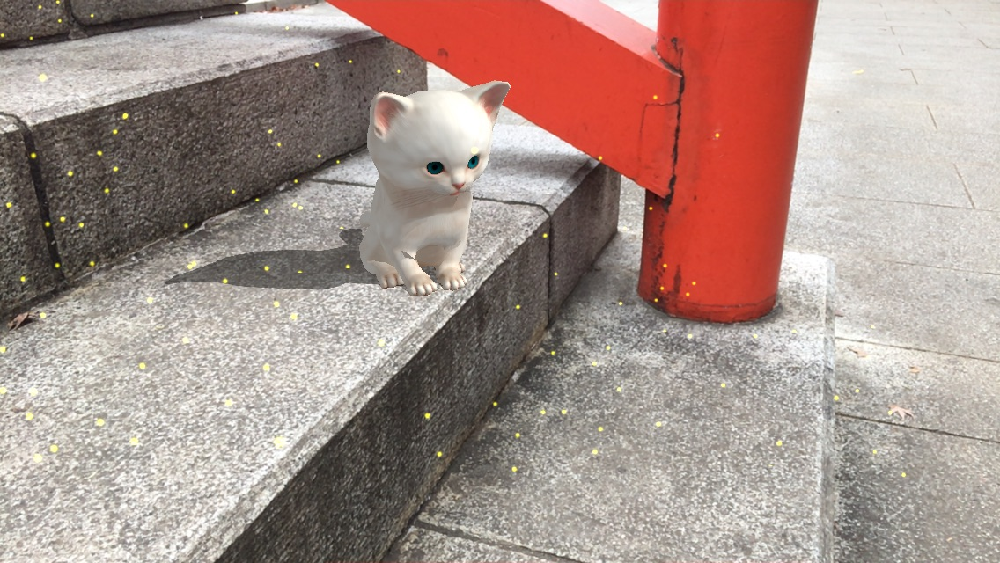

# ARKitten

※ ARKitプラグインがAsset Storeで提供されなくなったため、代替方法を[「ARKitプラグインの状況変化について」](https://github.com/ktaka/ARKitten/wiki/ARKit-Plugin)にまとめました。

技術評論社の月刊誌Software Designの短期連載記事「ARKitとUnityで作るiPhone ARアプリ集中特講」で開発するサンプルのリポジトリです。

[技術書典5](https://techbookfest.org/event/tbf05)で頒布した、この連載の元原稿から再構成した[本をBOOTHに登録してあります](https://zaxis-junkie.booth.pm/items/1040624)

[2018年5月号](http://gihyo.jp/magazine/SD/archive/2018/201805)の記事での完成状態がコミットされています。

これまでの連載の各号での完成状態は下記をご覧ください。
- [2018年2月号](https://github.com/ktaka/ARKitten/tree/part_2)
- [2018年3月号](https://github.com/ktaka/ARKitten/tree/part_3)
- [2018年4月号](https://github.com/ktaka/ARKitten/tree/part_4t)

### アイコンのパッケージ
4月号の107ページから108ページにかけて使用する猫とボールのアイコンのパッケージは[こちらから](https://github.com/ktaka/ARKitten/raw/part_4t/arkitten_textures.unitypackage)ダウンロードしてください。

## 2018年5月号
UnityのAsset Storeから[ARKitのプラグイン](http://u3d.as/RTd)、[FREE Food Pack](http://u3d.as/Mh3)、[Yughues Free Fabric Materials](https://assetstore.unity.com/packages/2d/textures-materials/fabric/yughues-free-fabric-materials-13002)をインポートしてからビルドしてください。

### 誌面掲載ソースコードの全文
- [リスト1 CatPreferences.cs](https://github.com/ktaka/ARKitten/blob/part_5/Assets/CatPreferences.cs)
- [リスト2 CatControl.cs](https://github.com/ktaka/ARKitten/blob/part_5/Assets/CatControl.cs)
- [リスト3 FoodControl.cs](https://github.com/ktaka/ARKitten/blob/part_5/Assets/FoodControl.cs)
- [リスト4 BallOperation.cs](https://github.com/ktaka/ARKitten/blob/part_5/Assets/BallOperation.cs)
- [リスト5 ControlAbstract.cs](https://github.com/ktaka/ARKitten/blob/part_5/Assets/ControlAbstract.cs)

## Cute Kittenのアセット
このプロジェクトで使用している猫のモデルのアセット（Cute Kitten）は元はUnityのAsset Storeからダウンロード、インポートしていました。
アセットの作者の事情によりAsset Storeからはこのアセットはダウンロードできなくなってしまいましたが、このサンプルプロジェクトに含める許可を頂きました。
作者の[Alexey Kuznetsov](http://leshiy3d.com/)氏に感謝します。

### 利用方法
「完成状態のものを見るだけではつまらない、解説記事の手順に沿って自分で開発したい！」という方は、下記2つの進め方があります。
- [2月号での完成状態](https://github.com/ktaka/ARKitten/tree/part_2)から始める
  - プロジェクトウィンドウのAssetsの下に既にKittenフォルダがあり、3月号の記事の分から自分の手で進められます
- 自分で作ったプロジェクトにアセットのフォルダをコピーする
  - このリポジトリをClone、もしくは[ダウンロード](https://github.com/ktaka/ARKitten/archive/master.zip)する
  - Finder等でARKitten/Assetsのフォルダを開き、Kittenフォルダがあることを確認する
  - KittenフォルダをUnityのプロジェクトウィンドウのAssetsの下にドラッグ＆ドロップする
  - プロジェクトウィンドウのAssetsの下にKittenフォルダが作成され、Asset Storeからインポートした際と同じ状態になります
  - Cute Kittenのインポート部分以外は各号の記事の手順の通りに進められます

Special thanks to [Alexey Kuznetsov](http://leshiy3d.com/), the creator of Cute Kitten.

## 日本語で質問出来るフォーラム
主にモバイル端末向けの[VRやARについて日本語で質問できるフォーラム](https://groups.google.com/d/forum/vr_ar_ja)があります。
ご質問等ありましたら、ぜひ[そちら](https://groups.google.com/d/forum/vr_ar_ja)からお願いします。
